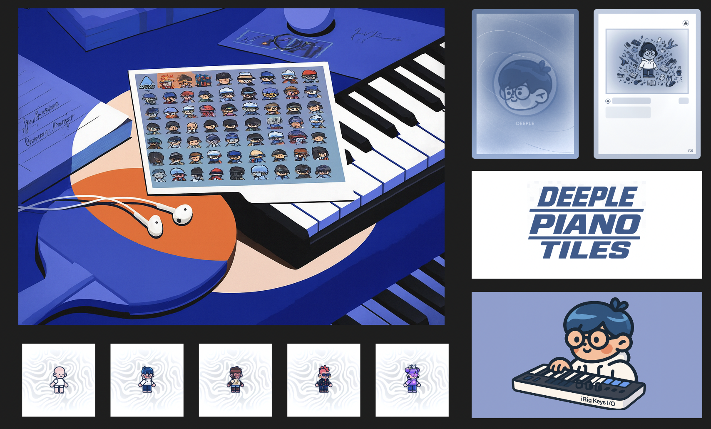

[▶ Watch the 5‑min demo (Tella)](https://www.tella.tv/video/cmepntscg000s0cjrfhpw996v?b=1&title=1&a=1&loop=0&t=0&muted=0&wt=1)

[▶ Interact with the demo (Vercel)](https://deeple-tiles.vercel.app/game)

# Deeple Tiles – Rhythm + Onchain + AI (Shape MCP Demo)

Built for the AI × NFT on Shape hackathon: an autonomous AI musician agent that composes melodies, mints them as on‑chain music cards, and challenges players to perform them. The prototype demonstrates innovation in AI‑driven NFT creation, on‑chain provenance, and community curation.

Next.js 15 app with Shape Sepolia, Wagmi/RainbowKit, Viem, and the Shape MCP toolchain. Includes an ERC‑721 (`contracts/DeepleTiles.sol`) with compact on‑chain meta (`mintWithMeta` + `notesHash`) and demo leaderboard events.

## Highlights

Built for the AI × NFT on Shape hackathon. Novel AI composition + onchain provenance; working prototype with Shape primitives; clear UX for evaluation.

- Play preset songs (Happy Birthday, Ode to Joy, etc.) or auto‑generated melodies
- AI Composer page to generate a song from prompt or from your NFT image (optional OpenAI)
- Holo‑effect Deeple card preview and gallery
- Mint a Deeple NFT (ERC‑721 `mint(address,string)` with JSON tokenURI)
- Publish runs and view them on `/public` as cards with notes
- Pay‑to‑play on `/public` (0.00001 ETH tip to creator before playing their notes)
- Leaderboard (file‑backed for demo) and optional on‑chain `publishRun` in the contract
- Poink embed link is copied on Publish for easy sharing

## How it works (AI × NFT on Shape)

- AI agent composes and mints “music cards” (`mintWithMeta` + `notesHash`), then hosts rhythm challenges; playable, tip‑able assets push AI x NFT boundaries.
- AI Agent: Generates from mood/genre or wallet context (filters to Deeple Tiles); plans compose → review → mint → challenge → publish; adapts via manual difficulty and song selection.
- Libraries: Next.js 15 + Wagmi/RainbowKit/Viem on Shape Sepolia (`eth_sendTransaction`, `encodeFunctionData`); Foundry + OpenZeppelin ERC‑721; `publishRun` events; server components + file‑backed stores.
- Impact: Shareable onchain challenges with provenance, creator tips, and a `/public` gallery; easy to extend with Shape primitives.
- Design: Compact shadcn UI, holo cards, featured grid, chat‑like AI steps, clear CTAs.


## App structure

```
app/
  game/               # landing (/game), select, gameplay, over modal
  preview/            # single-card preview + play button (no header/footer)
  public/             # published runs shown as holo cards
  api/
    publications/     # GET/POST publication store (file-backed)
    leaderboard/      # demo leaderboard API (file-backed)
contracts/
  DeepleTiles.sol     # ERC-721 + compact card meta + demo leaderboard events
script/
  DeepleTiles.s.sol   # Foundry deployment script
lib/                  # web3 + config + music gen utilities
```

## Gameplay loop

1) Landing (`/game`)
- Holo card preview on the right, featured cards on the left (titles = first 10 chars; bottom line shows notes).
- Buttons: Start Playing → Select screen; Choose Song → Select screen; Get your first Deeple → mint a demo NFT on Shape Sepolia.

2) Select screen
- Choose preset song and difficulty.
- AI Composer link to `/game/compose` for generating a new melody.

3) During game
- Hit number keys 1–0 as notes fall. Score + accuracy shown on HUD.
- For preset songs, Game Over triggers once the last note is spawned and the track clears.

4) Game Over modal
- Play Again / Main Menu
- Publish → saves the notes and pushes to `/api/publications`, copies Poink embed to clipboard, then navigates to `/public`.
- Share → copies `/public` link.
- After a successful onchain transaction (Shape Sepolia), the run is also posted to the leaderboard.

## AI Composer (`/game/compose`)

- Generate from prompt or filter wallet NFTs to only show Deeple Tiles tokens.
- The composer card preview always uses the Deeple Deeple cover image.
- Actions: Mint this card, Play this card (saves to localStorage and routes to `/game`), Discard.

## Preview (`/preview`)

- Minimal page: one holo card + Play button. No header/footer.
- Designed for embeds; Publish copies: `https://app.poink.xyz/embed?url=https://<your-domain>/preview`.

## Public gallery (`/public`)

- Shows published entries as holo cards (3 per row).
- Each card renders:
  - Title = compressed contract address (e.g., `0xC5.....18F`) if configured, else fallback
  - Notes list `[...]`
  - “Pay 0.00001 and play” button
- The button sends 0.00001 ETH to the creator (or fallback), saves the notes as a generated composition, and routes to `/game` (auto‑starts).

## Onchain contract – `contracts/DeepleTiles.sol`

- ERC‑721 with:
  - `mint(address to, string uri)` – basic mint
  - `mintWithMeta(address to, string title, string mediaURI, bytes32 notesHash)` – compact on‑chain meta
  - `publishRun(uint256 score, uint256 accuracy, bytes32 songHash)` – demo on‑chain leaderboard event
  - `tipCreator(uint256 tokenId)` – forward ETH tips to card creator
- View helpers: `getCard`, `getLeaderboard`, `getLeaderboardLength`

> Note: for the hackathon demo we keep “on‑chain‑like” meta compact and push full JSON as `tokenURI`. You can extend this to a full metadata pipeline (IPFS/Arweave) later.

## Environment variables

Set these in `.env` (and on Vercel → Project → Settings → Environment Variables):

```
NEXT_PUBLIC_WALLET_CONNECT_PROJECT_ID=...
NEXT_PUBLIC_ALCHEMY_KEY=...
NEXT_PUBLIC_CHAIN_ID=11011                   # Shape Sepolia
NEXT_PUBLIC_MCP_SERVER_URL=https://shape-mcp-server.vercel.app/mcp
NEXT_PUBLIC_DEEPLE_NFT_ADDRESS=0x...         # deployed DeepleTiles
OPENAI_API_KEY=...                           # optional; AI composer fallback exists
```

## Local development

```bash
cd "MCP backend"
# install deps
npm install
# dev
npm run dev
```

Open http://localhost:3000/game

## Foundry (contracts)

```bash
# install foundry
curl -L https://foundry.paradigm.xyz | bash
foundryup

# install OZ
forge install OpenZeppelin/openzeppelin-contracts

# build
forge build

# deploy (Shape Sepolia)
export PRIVATE_KEY=0xYOUR_KEY
export SHAPE_SEPOLIA_RPC_URL=https://sepolia.shape.network
forge script script/DeepleTiles.s.sol:DeepleTilesScript --rpc-url $SHAPE_SEPOLIA_RPC_URL --broadcast
```

Then set `NEXT_PUBLIC_DEEPLE_NFT_ADDRESS` with the deployed address.

## Deployment (Vercel)

- Root Directory: `MCP backend`
- Build: `next build`
- Output: `.next`
- Node.js: 20.x
- `next.config.ts`: `eslint.ignoreDuringBuilds = true` to bypass vendored lint errors
- Persistence: publications/leaderboard are file‑backed (ephemeral on serverless). For persistence replace the store with Vercel KV/Supabase/Postgres.

## Keyboard

- Keys `1..0` – hit lanes
- Ctrl+A – toggle Auto‑Play (dev/testing)

## Notes

- Holo effect uses CSS variables (`--mx`, `--my`, `--rx`, `--ry`, `--hyp`) and is attached to `.holo-card` via pointer handlers in each page.
- `/public` pay‑to‑play uses `eth_sendTransaction` for a simple value transfer (demo tip); route then auto‑loads and starts the game with those notes.

## License

MIT
